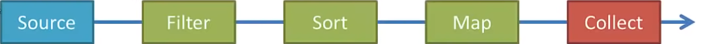
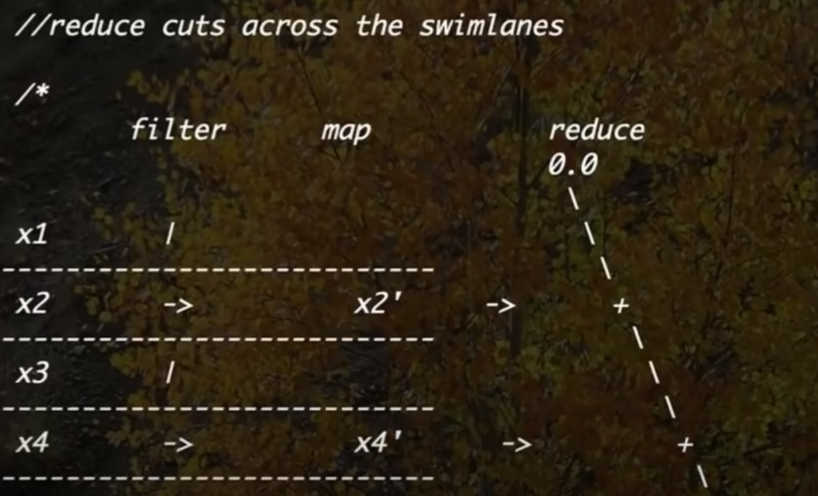

Streams are wrappers around a data source, allowing us to operate with that data source and make bulk processing convenient and fast.

A stream does not modify the underlying data source and also it is not a data structure (in the sense that it does not store data).

### Why use Stream ?
With few lines of code, you can do more. Use lambda expressions for processing. Can use parallel streams for concurrency.

### Stream Pipeline
Consists of a source, followed by zero or more intermediate operations, and a terminal operation.

 

1. Streams can be created from Collections, Lists, Sets, ints, longs, doubles, arrays, lines of files etc.
2. Intermediate operations such as `filter`, `map` or `sort` return a stream so we can chain multiple intermediate operations.
3. Terminal operations such as `forEach`, `collect` or `reduce` are either void or return a non-stream result. Collect saves the elements into a collection.

###  Operations
1. Order matters. For large datasets: `filter` first then sort or map
2. Some intermediate operations:  `distinct()`, `filter()`, `flatMap()`, `map()`, `skip()`, `sorted()`.
3. Some short-circuiting operations: `limit()` is intermediate operation. Others like `findFirst()`, `findAny()`, `anyMatch()`, `allMatch()`, `noneMatch()` are terminal operations.
4. Some other terminal operations: `toArray()`, `min()`, `max()`, `count()`, `summaryStatistics()`



### Stream Creation
You can create Stream in many ways. Few of them are listed below.

```java

// From array
Employee[] employees = ...;
Stream.of(employees);

// From ArrayList
List<Employee> employeeList = Arrays.asList(employees);
employeeList.stream();

// From individual objects
Stream.of(employees[0], employees[20], employees[50]);

// Using Stream.builder()
Stream.Builder<Employee> esb = Stream.builde();
esb.accept(employees[0]);
esb.accept(employees[5]);
esb.accept(employees[7]);

Stream<Employee> employeeStream = esb.build();
```

### Code Examples
```java
import java.lang.String;
import java.util.Arrays;
import java.util.List;
import java.util.stream.*;
import java.util.*;
import java.nio.file.*;
import java.io.IOException;
import static java.util.stream.Collectors.*;

// Few modifications to : https://github.com/joeyajames/Java/blob/master/Java%208%20Streams/JavaStreams.java
public class StreamExamples {
    public static void main(String[] args) throws IOException {
	// 1. Integer Stream
	IntStream
	    .range(1, 10)   // 1 to 9
	    .forEach(System.out::print);  //method ref: x -> System.out.print(x)
	System.out.println();
	// 123456789

	// 2. Integer Stream with skip
	IntStream
	    .range(1, 10)
	    .skip(5)          // skip first 5 elements
	    .forEach(System.out::print);
	System.out.println();
	// 6789

	// 3. Skip and limit
	int offset = 5;
	int limit = 10;
	
	List<Integer> limitedList = Stream.iterate (0, i -> i + 3)  // infinite
	    .filter(i -> i % 2 == 0)
	    .skip(offset)    // if we did not skip 0 to 54
	    .limit(limit)    // number of items in result
	    .collect(Collectors.toList());    // or toSet() if you need Set
	System.out.println(limitedList);
	// [30, 36, 42, 48, 54, 60, 66, 72, 78, 84]

	// 4. Integer Stream with sum
	System.out.println(
			   IntStream
			   .range(1, 5)    // exclusive
			   .sum());
	// 10  

	// 5. Stream.of, sorted and findFirst (returns Optional)
	Stream.of("Car", "Bird", "Apple")
	    .sorted()     // Can pass Comparator
	    .findFirst()  // returns Optional
	    .ifPresent(System.out::println);
	// Apple

	// 6. Stream from array, use filter
	String[] names = {"Car", "Apple", "Ball", "Cat", "Bag"};
	Arrays.stream(names)
	    .filter(x -> x.startsWith("B"))
	    .sorted()
	    .forEach(x -> System.out.print(x + ", "));
   
	// Bag, Ball,

	// 7. Average of squares of an int array
	Arrays.stream(new int[] {2, 4, 6, 8, 10})
	    .map(x -> x * x)
	    .average()         // returns OptionalDouble
	    .ifPresent(System.out::println);

	// 44.0

	// 8. Stream from List, filter and print
	List<String> namesList = Arrays.asList("Car", "Apple", "Ball", "Cat", "Bag");
	namesList
	    .stream()
	    .map(String::toLowerCase)
	    .filter(x -> x.startsWith("b"))
	    .forEach(System.out::println);

	// ball
	// bag

	// 9. Stream rows from text file, sort, filter and print
	// bands.txt contains following lines
	/*
	  Rolling Stones
	  Lady Gaga
	  Jackson Browne
	  Maroon 5
	*/
	Stream<String> bands = Files.lines(Paths.get("bands.txt"));

	bands
	    .sorted()
	    .filter(x -> x.length() > 12)
	    .forEach(System.out::println);

	bands.close();   // since file operation, close the stream

	// Jackson Browne
	// Rolling Stones

	// 10. Stream rows from text file and save to List
	List<String> bands2 = Files.lines(Paths.get("bands.txt"))
	    .filter(x -> x.contains("on"))
	    .collect(Collectors.toList());

	System.out.println();
	bands2.forEach(System.out::println);
	// Rolling Stones
	// Jackson Browne
	// Maroon 5

	// 11. Stream rows from CSV file and count
	// data.txt
	/*
	  A,12,3.7
	  B,17,2.8
	  C,14,1.9
	  D,23,2.7
	  E
	  F,18,3.4
	*/
	Stream<String> rows1 = Files.lines(Paths.get("data.txt"));
	int rowCount = (int)rows1
	    .map(x -> x.split(","))
	    .filter(x -> x.length == 3)
	    .count();

	System.out.println(rowCount + " rows");
	rows1.close();

	// 5 rows

	// 12. Stream rows from CSV file, parse data from rows
	Stream<String> rows2 = Files.lines(Paths.get("data.txt"));
	rows2
	    .map(x -> x.split(","))
	    .filter(x -> x.length == 3)
	    .filter(x -> Integer.parseInt(x[1]) > 15)
	    .forEach(x -> System.out.println(x[0] + " " + x[2]));
	rows2.close();

	// B 2.8
	// D 2.7
	// F 3.4

	// 13. Stream rows from CSV file, store fields in HashMap
	Stream<String> rows3 = Files.lines(Paths.get("data.txt"));
	Map<String, Integer> map1 = rows3
	    .map(x -> x.split(","))
	    .filter(x -> x.length == 3)
	    .filter(x -> Integer.parseInt(x[1]) > 15)
	    .collect(Collectors.toMap(x -> x[0], x -> Integer.parseInt(x[1])));

	rows3.close();

	System.out.println();
	
	for (String key : map1.keySet()) {
	    System.out.println(key + " " + map1.get(key));
	}
	
	// map.entrySet().stream().forEach(e -> System.out.println(e.getKey() + " " + e.getValue()));

	// import static java.util.stream.Collectors.*;
	// Let's say we have Person(name:String, age:int) => ("Jack", 23), ("Jack", 15), ("Bob", 18)
	List<Person> people = Arrays.asList(new Person("Jack", 23), new Person("Jack", 15), new Person("Bob", 18));
	Map<String, List<Integer>> map2 = people.stream()
	    .collect(groupingBy(Person::getName, mapping(Person::getAge, toList())));

	System.out.println(map2);
	// {Bob=[18], Jack=[23, 15]}
	
		
		
	// B 17
	// D 23
	// F 18

	// 14. Reduction - sum
	double total = Stream.of(7.3, 1.5, 4.8)
	    //.reduce(0.0, (Double a, Double b) -> {return a + b;});
	    .reduce(0.0, (a, b) -> a + b);
	
	System.out.println("Total = " + total);
	// Total = 13.600000000000001

    }    
	
    static class Person {
	private String name;
	private int age;
		
	public Person(String name, int age) {
	    this.name = name;
	    this.age = age;
	}

	public String getName() { return this.name; }
	public int getAge() { return this.age; }
    }
}
```


## References
1. https://stackify.com/streams-guide-java-8/
2. https://www.youtube.com/watch?v=t1-YZ6bF-g0
3. https://www.logicbig.com/tutorials/core-java-tutorial/java-util-stream/short-circuiting.html
4. https://www.youtube.com/watch?v=rGJAk2W2HbI